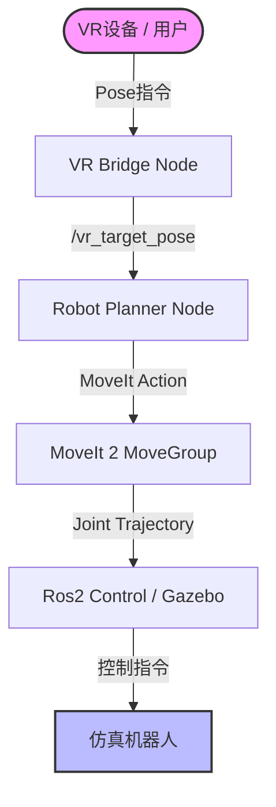

# 🤖 Franka Emika + Ranger Mini 复合机器人仿真平台

**基于 ROS 2 Humble 的高性能复合移动操作机器人仿真环境**

[查看文档](https://github.com/fjc6666) · [报告 Bug](https://github.com/fjc6666/Combining-the-motion-planning-of-Franka-and-Ranger-Mini-without-servo/issues) · [提出新功能](https://github.com/fjc6666/Combining-the-motion-planning-of-Franka-and-Ranger-Mini-without-servo/issues)

---

## 📖 项目简介

本项目实现了 **Franka Emika (Panda)** 7自由度机械臂与 **AgileX Ranger Mini V2** 全向移动底盘的系统级集成。打通了 URDF 模型组合、Gazebo 物理仿真、MoveIt 2 运动规划以及 VR 遥操作信号的初步链路。

### ✨ 核心特性

| 模块 | 特性描述 |
| :--- | :--- |
| **🦾 高精度仿真** | 完整的 TF 树校准 (Base -> Franka)，集成四轮转向动力学。 |
| **🧠 运动规划** | 基于 **MoveIt 2** (OMPL)，配置完整的碰撞矩阵 (ACM) 与 SRDF，支持 RViz 交互。 |
| **🎮 VR 遥操作** | (Beta) 预留 VR 数据桥接节点 `vr_bridge`，集成笛卡尔空间规划器。 |

---

## 🏗️ 2. 系统架构

🛠️ 安装指南
1. 环境依赖
OS: Ubuntu 22.04 LTS

ROS: ROS 2 Humble Hawksbill

安装必要的 ROS 功能包：

Bash

sudo apt update
sudo apt install ros-humble-moveit \
                 ros-humble-ros2-control \
                 ros-humble-ros2-controllers \
                 ros-humble-gazebo-ros2-control \
                 ros-humble-xacro \
                 ros-humble-joint-state-publisher-gui \
                 git-lfs
2. 克隆与编译
⚠️ 重要：本项目包含大型 3D 模型文件，必须使用 Git LFS。

Bash

# 1. 初始化 Git LFS
git lfs install

# 2. 克隆仓库
git clone [https://github.com/fjc6666/Combining-the-motion-planning-of-Franka-and-Ranger-Mini-without-servo.git](https://github.com/fjc6666/Combining-the-motion-planning-of-Franka-and-Ranger-Mini-without-servo.git)
cd Combining-the-motion-planning-of-Franka-and-Ranger-Mini-without-servo

# 3. 编译工作空间
colcon build 

# 4. 配置环境变量
source install/setup.bash
🚀 快速启动 (Quick Start)
请按照以下顺序在不同的终端窗口中运行指令。

Step 1: 启动仿真环境 (Core)
启动 Gazebo 物理引擎、加载机器人模型、MoveIt 2 规划框架以及 RViz 可视化界面。

Bash

ros2 launch my_composite_robot_config bringup_gazebo.launch.py
✅ 成功标志：Gazebo 和 RViz 窗口弹出，终端显示 [moveit_simple_controller_manager]: Returned 1 controllers。

Step 2: 启动 VR 数据桥接
该节点负责接收 VR 设备数据（或模拟数据）并发布目标位姿话题 /vr_target_pose。

Bash

ros2 run vr_vision_teleop vr_bridge.py
Step 3: 启动规划执行器
该节点订阅目标位姿，调用 MoveIt 接口规划路径并控制机械臂运动。

Bash

ros2 launch vr_vision_teleop start_planner.launch.py
📂 目录结构说明
Plaintext

src/
├── 📦 composite_robot_description/     # [核心] 机器人描述包 (URDF/Xacro)
│   ├── urdf/mobile_manipulator.urdf.xacro  # 主模型入口
│   └── config/controllers.yaml             # ros2_control 控制器参数
│
├── ⚙️ my_composite_robot_config/       # [配置] MoveIt 配置包
│   ├── config/moveit_controllers.yaml      # MoveIt 控制器桥接
│   └── launch/bringup_gazebo.launch.py     # 系统总启动入口
│
├── 🎮 vr_vision_teleop/                # [功能] VR 遥操作功能包
│   ├── src/robot_planner.cpp               # 规划节点源码
│   └── scripts/vr_bridge.py                # VR 数据桥接脚本
│
├── 🚗 ranger_mini_v2_description/      # [底盘] AgileX Ranger Mini 描述
└── 🔌 four_wheel_steering_controller/  # [插件] 四轮转向控制器
🔧 常见问题 (FAQ)

 
<strong>Q2: 运行 git push 时提示文件过大？</strong>

A: 请确保已安装 git-lfs 并对 .dae 文件进行了 track。本项目中 ranger_base.dae 较大，建议不要直接修改该二进制文件。

 
<strong>Q3: RViz 中显示 "No controller_names specified" 报错？</strong>

A: 请检查 moveit_controllers.yaml 中的缩进是否正确。MoveIt 需要正确的命名空间（moveit_simple_controller_manager）才能找到参数。

📅 开发路线图 (Roadmap)
[x] Phase 1 (Current): 仿真环境搭建，MoveIt 基础规划 (Plan & Execute) 打通。

[ ] Phase 2: 集成 MoveIt Servo，实现高频实时伺服控制。

[ ] Phase 3: 接入 MediaPipe 人体姿态估计，实现肘部构型映射。

[ ] Phase 4: 视觉-力反馈闭环测试。

Maintainer: fjc6666
email:fjc66666@outlook.com

