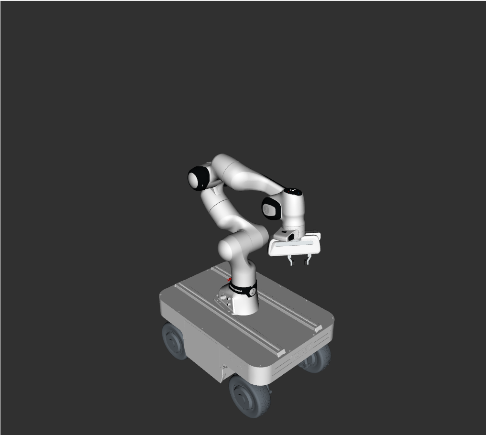
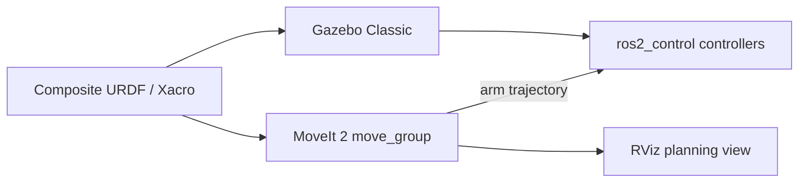
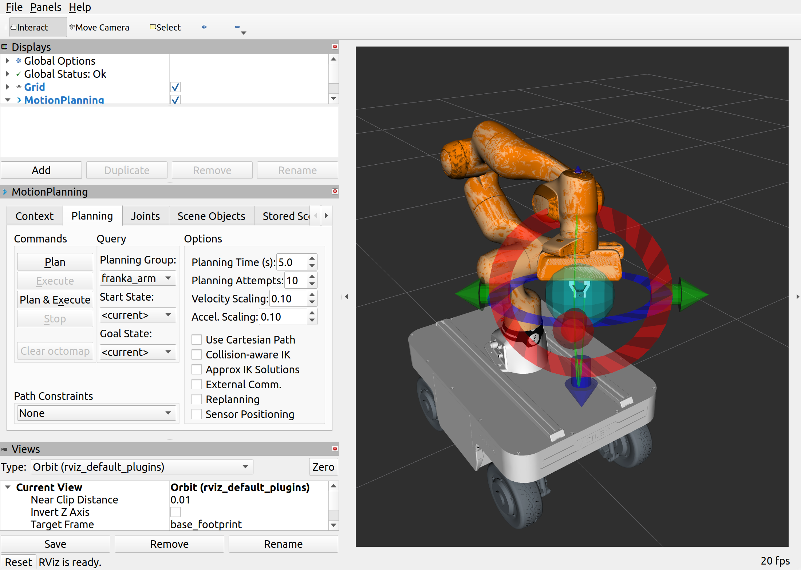

# Franka × Ranger Mini | Mobile Manipulator Simulation

<p align="center"><strong>ROS 2 Humble · Gazebo Classic · MoveIt 2 · ros2_control</strong></p>
<p align="center">A simulation workspace that brings a Franka arm and Ranger Mini V2 base into one robot model and planning environment.</p>

> **Scope:** This repository contains the combined robot model, Gazebo integration, controllers, and MoveIt configuration. Experimental pose publishing and planning live in the separate [vr_vision_teleop](https://github.com/fjc6666/vr_vision_teleop) repository. This integration uses plan and execute; MoveIt Servo is not implemented here.



*Combined robot model in RViz, captured after launching the repository's ROS 2 workspace.*

## At a glance

| Layer | Included implementation |
| --- | --- |
| Robot model | Ranger Mini V2 base and Franka arm assembled with URDF/Xacro |
| Simulation | Gazebo Classic spawn and gazebo_ros2_control |
| Control | Joint state broadcaster, arm trajectory controller, Ranger base controller |
| Planning | MoveIt 2 SRDF, kinematics, joint limits, controller mapping, and RViz configuration |

## Architecture


```mermaid
flowchart LR
    X[Composite URDF / Xacro] --> G[Gazebo Classic]
    G --> C[ros2_control controllers]
    X --> M[MoveIt 2 move_group]
    M -->|arm trajectory| C
    M --> R[RViz planning view]
```

The main entry point is [bringup_gazebo.launch.py](src/my_composite_robot_config/launch/bringup_gazebo.launch.py). It starts Gazebo, spawns the model, loads controllers, then starts move_group and RViz. [moveit_controllers.yaml](src/my_composite_robot_config/config/moveit_controllers.yaml) maps the arm trajectory action to seven FR3 joints.



*MoveIt planning interface from the integrated launch, with the `franka_arm` group available.*

## Quick start

**Target environment:** Ubuntu 22.04 and ROS 2 Humble, with Gazebo Classic, MoveIt 2, ros2_control, Xacro, rosdep, and colcon. Other ROS distributions are unverified.

```bash
sudo apt update
sudo apt install git-lfs python3-colcon-common-extensions python3-rosdep \
  ros-humble-moveit ros-humble-gazebo-ros-pkgs \
  ros-humble-gazebo-ros2-control ros-humble-ros2-controllers \
  ros-humble-xacro

git lfs install
git clone https://github.com/fjc6666/Combining-the-motion-planning-of-Franka-and-Ranger-Mini-without-servo.git
cd Combining-the-motion-planning-of-Franka-and-Ranger-Mini-without-servo
source /opt/ros/humble/setup.bash
rosdep install --from-paths src --ignore-src -r -y
colcon build --symlink-install
source install/setup.bash
ros2 launch my_composite_robot_config bringup_gazebo.launch.py
```

In RViz, select the `franka_arm` planning group and use **Plan & Execute**.

## Repository map

| Path | Purpose |
| --- | --- |
| [composite_robot_description](src/composite_robot_description) | Combined robot model |
| [my_composite_robot_config](src/my_composite_robot_config) | MoveIt configuration and integrated launch |
| [ranger_mini_v2_description](src/ranger_mini_v2_description) | Base model and meshes |
| [ranger_mini_v2_control](src/ranger_mini_v2_control) | Base control package |
| [four_wheel_steering_controller](src/four_wheel_steering_controller) | Steering controller |

## Engineering notes

- Controller loading is ordered after the Gazebo robot spawn.
- MoveIt sends arm trajectories to the Franka controller. Base control is separate; this is not whole-body planning.
- Large DAE meshes use Git LFS; install LFS before cloning.
- Upstream robot descriptions and controller code are included alongside the integration work.
- The Franka Hand Xacro invocation uses the `arm_id` parameter expected by the ROS 2 Humble Franka description installed with this setup.

## 中文简介

本仓库将 Franka 机械臂与 Ranger Mini V2 底盘组合为一个 ROS 2 仿真模型，配置 Gazebo Classic、ros2_control 与 MoveIt 2，并提供集成启动入口。重点是**模型、控制器和规划环境的系统集成**。目前机械臂使用轨迹规划执行，底盘控制与机械臂规划分开；VR 实验代码位于独立仓库。
